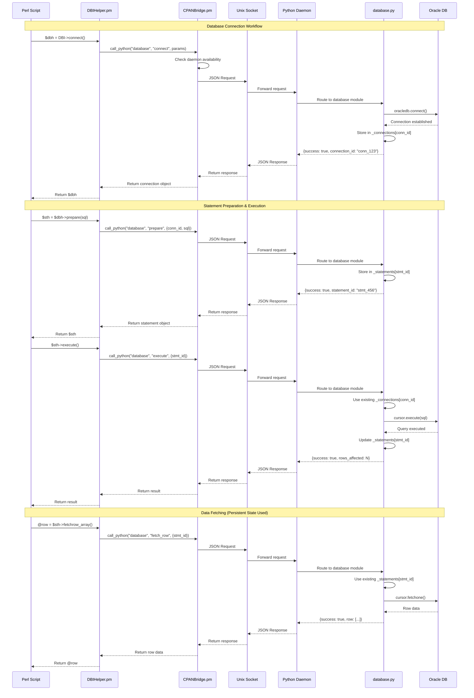
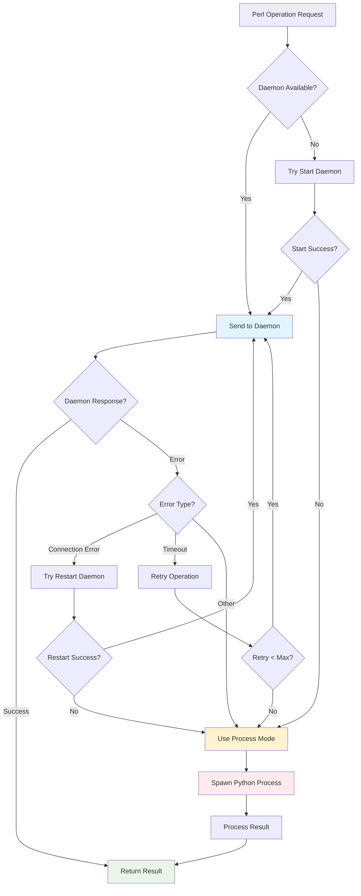
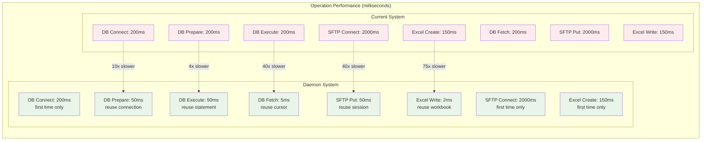
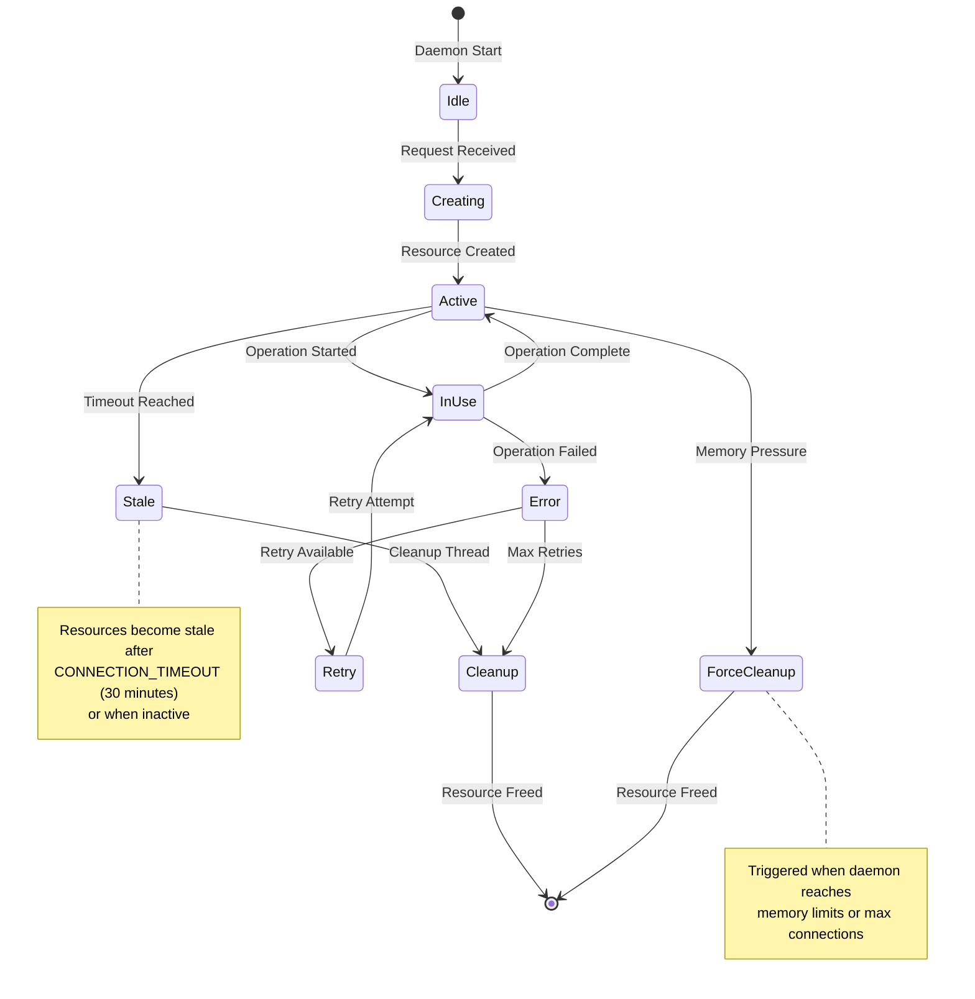
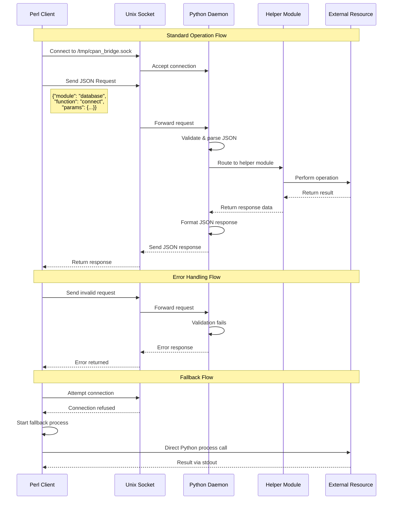

# CPAN Bridge Daemon Architecture - Mermaid Diagrams

## Overview
This document contains Mermaid diagrams for the proposed daemon-based CPAN Bridge architecture.

---

## 1. High-Level System Architecture

```mermaid
graph TB
    subgraph "Perl Environment"
        CM[ControlM Jobs] --> PS[Perl Scripts]
        PS --> DBI[DBIHelper.pm]
        PS --> MAIL[MailHelper.pm]
        PS --> SFTP[SFTPHelper.pm]
        PS --> EXCEL[ExcelHelper.pm]
        PS --> CRYPTO[CryptHelper.pm]
        PS --> XPATH[XPathHelper.pm]
        PS --> LOG[LogHelper.pm]

        DBI --> CB[CPANBridge.pm]
        MAIL --> CB
        SFTP --> CB
        EXCEL --> CB
        CRYPTO --> CB
        XPATH --> CB
        LOG --> CB
    end

    subgraph "Communication Layer"
        CB --> SOCK[Unix Domain Socket<br>/tmp/cpan_bridge.sock]
    end

    subgraph "Python Daemon Process"
        SOCK --> DAEMON[CPAN Bridge Daemon<br>cpan_daemon.py]
        DAEMON --> ROUTER[Request Router]

        ROUTER --> DB_MOD[database.py]
        ROUTER --> EMAIL_MOD[email_helper.py]
        ROUTER --> SFTP_MOD[sftp.py]
        ROUTER --> EXCEL_MOD[excel.py]
        ROUTER --> CRYPTO_MOD[crypto.py]
        ROUTER --> XPATH_MOD[xpath.py]
        ROUTER --> LOG_MOD[logging_helper.py]

        subgraph "Persistent State"
            CONNECTIONS[_connections{}]
            STATEMENTS[_statements{}]
            SFTP_SESS[SFTP_SESSIONS{}]
            WORKBOOKS[WORKBOOKS{}]
            WORKSHEETS[WORKSHEETS{}]
            CIPHERS[CIPHER_INSTANCES{}]
            DOCUMENTS[_documents{}]
            LOGGERS[LOGGERS{}]
        end

        DB_MOD --> CONNECTIONS
        DB_MOD --> STATEMENTS
        SFTP_MOD --> SFTP_SESS
        EXCEL_MOD --> WORKBOOKS
        EXCEL_MOD --> WORKSHEETS
        CRYPTO_MOD --> CIPHERS
        XPATH_MOD --> DOCUMENTS
        LOG_MOD --> LOGGERS
    end

    subgraph "External Resources"
        ORACLE[(Oracle Database)]
        INFORMIX[(Informix Database)]
        SFTP_SERVER[SFTP Servers]
        SMTP_SERVER[SMTP Servers]
        FILES[File System]
    end

    DB_MOD --> ORACLE
    DB_MOD --> INFORMIX
    SFTP_MOD --> SFTP_SERVER
    EMAIL_MOD --> SMTP_SERVER
    EXCEL_MOD --> FILES

    style DAEMON fill:#e1f5fe
    style CONNECTIONS fill:#f3e5f5
    style STATEMENTS fill:#f3e5f5
    style SFTP_SESS fill:#f3e5f5
    style WORKBOOKS fill:#f3e5f5
    style WORKSHEETS fill:#f3e5f5
    style CIPHERS fill:#f3e5f5
    style DOCUMENTS fill:#f3e5f5
    style LOGGERS fill:#f3e5f5
```

---

## 2. Process Flow Sequence Diagram



---

## 3. Multi-Module Workflow Diagram

```mermaid
graph TD
    START[Business Process Start] --> CONNECT[Database Connect]

    subgraph "Daemon State Management"
        CONNECT --> CONN_STORE[Store connection_id<br>in _connections{}]
        PREP --> STMT_STORE[Store statement_id<br>in _statements{}]
        EXCEL_CREATE --> WB_STORE[Store workbook_id<br>in WORKBOOKS{}]
        WS_CREATE --> WS_STORE[Store worksheet_id<br>in WORKSHEETS{}]
    end

    CONN_STORE --> EXCEL_CREATE[Create Excel Workbook]
    WB_STORE --> PREP[Prepare SQL Statement]
    STMT_STORE --> EXEC[Execute SQL]
    EXEC --> WS_CREATE[Create Worksheet]
    WS_STORE --> LOOP_START[Start Data Loop]

    subgraph "Data Processing Loop"
        LOOP_START --> FETCH[Fetch Row from DB<br>Uses: _statements[stmt_id]]
        FETCH --> WRITE[Write to Excel<br>Uses: WORKSHEETS[ws_id]]
        WRITE --> MORE{More Data?}
        MORE -->|Yes| FETCH
        MORE -->|No| LOOP_END[End Loop]
    end

    LOOP_END --> CLOSE[Close Excel File<br>Uses: WORKBOOKS[wb_id]]
    CLOSE --> EMAIL[Send Email with File]
    EMAIL --> END[Process Complete]

    style CONN_STORE fill:#e8f5e8
    style STMT_STORE fill:#e8f5e8
    style WB_STORE fill:#e8f5e8
    style WS_STORE fill:#e8f5e8
    style FETCH fill:#fff3cd
    style WRITE fill:#fff3cd
```

---

## 4. State Persistence Comparison

```mermaid
graph TB
    subgraph "Current Architecture (Process per Operation)"
        P1[Process 1:<br>DB Connect] --> F1[File Save<br>connection metadata]
        P2[Process 2:<br>Excel Create] --> F2[File Save<br>workbook state]
        P3[Process 3:<br>DB Prepare] --> F3[File Load + Save<br>connection + statement]
        P4[Process 4:<br>Excel Write] --> F4[File Load + Save<br>workbook + cell data]
        P5[Process 5:<br>DB Fetch] --> F5[File Load<br>connection + statement]

        F1 -.->|File I/O<br>10-50ms| F3
        F2 -.->|File I/O<br>10-50ms| F4
        F3 -.->|File I/O<br>10-50ms| F5

        style P1 fill:#ffebee
        style P2 fill:#ffebee
        style P3 fill:#ffebee
        style P4 fill:#ffebee
        style P5 fill:#ffebee
    end

    subgraph "Daemon Architecture (Persistent State)"
        D[Single Daemon Process]

        subgraph "In-Memory State"
            CONN[_connections{}]
            STMT[_statements{}]
            WB[WORKBOOKS{}]
            WS[WORKSHEETS{}]
        end

        D --> CONN
        D --> STMT
        D --> WB
        D --> WS

        OP1[Operation 1:<br>DB Connect] --> CONN
        OP2[Operation 2:<br>Excel Create] --> WB
        OP3[Operation 3:<br>DB Prepare] --> STMT
        OP4[Operation 4:<br>Excel Write] --> WS
        OP5[Operation 5:<br>DB Fetch] --> STMT

        CONN -.->|Memory Access<br>0.1ms| STMT
        WB -.->|Memory Access<br>0.1ms| WS
        STMT -.->|Memory Access<br>0.1ms| STMT

        style D fill:#e8f5e8
        style CONN fill:#f3e5f5
        style STMT fill:#f3e5f5
        style WB fill:#f3e5f5
        style WS fill:#f3e5f5
        style OP1 fill:#e1f5fe
        style OP2 fill:#e1f5fe
        style OP3 fill:#e1f5fe
        style OP4 fill:#e1f5fe
        style OP5 fill:#e1f5fe
    end
```

---

## 5. Failure Handling Flow



---

## 6. Performance Comparison Chart



---

## 7. Daemon Internal Architecture

```mermaid
graph TB
    subgraph "Python Daemon Process"
        MAIN[Main Thread<br>cpan_daemon.py] --> SOCKET[Unix Socket Server]
        MAIN --> HEALTH[Health Check Thread]
        MAIN --> CLEANUP[Cleanup Thread]

        SOCKET --> ACCEPT[Accept Connections]
        ACCEPT --> WORKER[Worker Thread<br>per Request]

        WORKER --> PARSE[Parse JSON Request]
        PARSE --> VALIDATE[Validate Request]
        VALIDATE --> ROUTE[Route to Module]

        ROUTE --> DB[database.py]
        ROUTE --> SFTP[sftp.py]
        ROUTE --> EXCEL[excel.py]
        ROUTE --> CRYPTO[crypto.py]
        ROUTE --> XPATH[xpath.py]
        ROUTE --> EMAIL[email_helper.py]
        ROUTE --> LOG[logging_helper.py]

        subgraph "Shared State (Thread-Safe)"
            DB_STATE[Database State<br>_connections{}<br>_statements{}]
            SFTP_STATE[SFTP State<br>SFTP_SESSIONS{}]
            EXCEL_STATE[Excel State<br>WORKBOOKS{}<br>WORKSHEETS{}]
            CRYPTO_STATE[Crypto State<br>CIPHER_INSTANCES{}]
            XPATH_STATE[XPath State<br>_documents{}]
            LOG_STATE[Logging State<br>LOGGERS{}]
        end

        DB --> DB_STATE
        SFTP --> SFTP_STATE
        EXCEL --> EXCEL_STATE
        CRYPTO --> CRYPTO_STATE
        XPATH --> XPATH_STATE
        LOG --> LOG_STATE

        DB_STATE --> LOCKS1[Thread Locks]
        SFTP_STATE --> LOCKS2[Thread Locks]
        EXCEL_STATE --> LOCKS3[Thread Locks]

        HEALTH --> MONITOR[Monitor Resources]
        MONITOR --> DB_STATE
        MONITOR --> SFTP_STATE
        MONITOR --> EXCEL_STATE

        CLEANUP --> CLEAN[Clean Stale Resources]
        CLEAN --> DB_STATE
        CLEAN --> SFTP_STATE
        CLEAN --> EXCEL_STATE
    end

    subgraph "External Resources"
        EXT_DB[(Databases)]
        EXT_SFTP[SFTP Servers]
        EXT_FILES[File System]
        EXT_SMTP[SMTP Servers]
    end

    DB --> EXT_DB
    SFTP --> EXT_SFTP
    EXCEL --> EXT_FILES
    EMAIL --> EXT_SMTP

    style MAIN fill:#e1f5fe
    style DB_STATE fill:#f3e5f5
    style SFTP_STATE fill:#f3e5f5
    style EXCEL_STATE fill:#f3e5f5
    style CRYPTO_STATE fill:#f3e5f5
    style XPATH_STATE fill:#f3e5f5
    style LOG_STATE fill:#f3e5f5
```

---

## 8. Resource Lifecycle Management



---

## 9. Communication Protocol Flow



This comprehensive set of Mermaid diagrams provides visual representation of:

1. **System Architecture** - Overall component relationships
2. **Process Flow** - Detailed sequence of operations
3. **Multi-Module Workflow** - How different modules interact
4. **State Persistence** - Current vs daemon architecture comparison
5. **Failure Handling** - Error recovery and fallback mechanisms
6. **Performance Comparison** - Visual performance improvements
7. **Internal Architecture** - Daemon threading and state management
8. **Resource Lifecycle** - How resources are managed over time
9. **Communication Protocol** - Detailed message flow between components

These diagrams make the complex daemon architecture easy to understand and communicate to stakeholders!