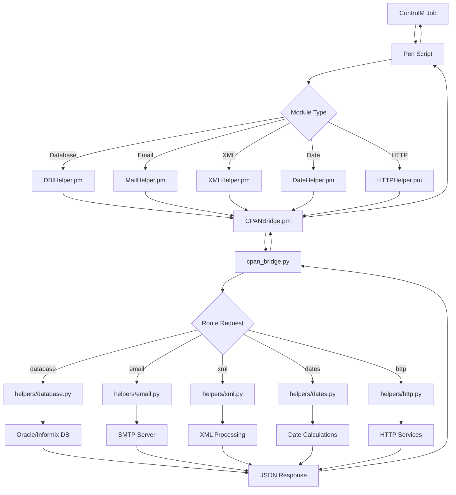

# NADC Migration Project - CPAN Bridge Solution

A hybrid Perl-Python architecture for replacing CPAN dependencies in locked-down RHEL 9 environments.

## Overview

This project provides drop-in replacements for CPAN modules by routing operations through Python backends, allowing Perl scripts to run in environments where CPAN installation is restricted.

## Architecture

### System Flow


### Communication Flow
```
┌─────────────┐    ┌─────────────┐    ┌─────────────┐    ┌─────────────┐    ┌─────────────┐
│  ControlM   │───▶│    Perl     │───▶│   Helper    │───▶│    CPAN     │───▶│   Python    │
│    Jobs     │    │   Scripts   │    │  Module.pm  │    │  Bridge.pm  │    │   Backend   │
└─────────────┘    └─────────────┘    └─────────────┘    └─────────────┘    └─────────────┘
                                                                │                      │
                                                                ▼                      ▼
                                                        ┌─────────────┐    ┌─────────────┐
                                                        │ cpan_bridge │    │  helpers/   │
                                                        │    .py      │───▶│ module.py   │
                                                        └─────────────┘    └─────────────┘
                                                                │                      │
                                                                ▼                      ▼
                                                        ┌─────────────┐    ┌─────────────┐
                                                        │    JSON     │    │  External   │
                                                        │   over      │    │  Services   │
                                                        │   Pipes     │    │ (DB/SMTP)   │
                                                        └─────────────┘    └─────────────┘
```

## Installation

### File Structure
```
your_project/
├── CPANBridge.pm                    # Core bridge class
├── DBIHelper.pm                     # Database operations
├── MailHelper.pm                    # Email operations
├── XMLHelper.pm                     # XML processing
├── XPathHelper.pm                   # XPath processing
├── DateTimeHelper.pm                # DateTime operations
├── HTTPHelper.pm                    # HTTP operations
├── SFTPHelper.pm                    # SFTP file transfers
├── SSHHelper.pm                     # SSH operations (Net::OpenSSH replacement)
├── LockFileHelper.pm                # File locking with NFS support
├── LogHelper.pm                     # Logging operations
├── ExcelHelper.pm                   # Excel file generation
├── CryptHelper.pm                   # Encryption operations
├── Test_Scripts/test_*.pl           # Test scripts
├── Test_Scripts/load_test_throttling.pl    # Comprehensive load testing
├── Test_Scripts/quick_load_test.pl         # Quick throttling test
├── BASELINE_TESTING_STORIES.md      # Core functionality tests
├── TESTING_STORIES.md               # Comprehensive test documentation
├── USER_GUIDE.md                    # User documentation
├── PRODUCTION_OPERATIONS.md         # Operations guide
└── python_helpers/
    ├── cpan_bridge.py               # Legacy router (process-per-operation)
    ├── cpan_daemon.py               # High-performance daemon (persistent)
    └── helpers/
        ├── database.py              # Oracle database backend
        ├── email_helper.py          # Email backend
        ├── xml.py                   # XML processing backend
        ├── xpath.py                 # XPath processing backend
        ├── datetime_helper.py       # DateTime backend
        ├── http_helper.py           # HTTP backend
        ├── sftp.py                  # SFTP backend
        ├── openssh.py               # SSH backend
        ├── lockfile.py              # File locking backend
        ├── logging_helper.py        # Logging backend
        ├── excel.py                 # Excel backend
        └── crypto.py                # Encryption backend
```

### Prerequisites
- **Perl**: Core modules only (no CPAN required)
  - Uses `JSON::PP` (included in Perl core since v5.14)
- **Python**: 3.8+ with required packages:
  ```bash
  pip install oracledb paramiko openpyxl lxml cryptography psutil
  ```

### Python Dependencies
| Module | Purpose | Required For |
|--------|---------|--------------|
| `oracledb` | Oracle database connectivity | Database operations |
| `paramiko` | SFTP operations | File transfers (fallback: subprocess+ssh) |
| `openpyxl` | Excel file generation | Excel operations (fallback: xlsxwriter) |
| `lxml` | XPath processing | XML operations with XPath |
| `cryptography` | Encryption operations | Password encryption |
| `psutil` | System resource monitoring | Daemon monitoring and health checks |

### Environment Variables (Optional)
```bash
# Legacy mode (process-per-operation)
export CPAN_BRIDGE_DEBUG=1              # Enable debug output
export CPAN_BRIDGE_SCRIPT=/path/to/cpan_bridge.py
export PYTHON_EXECUTABLE=/usr/bin/python3
export PERL_LWP_SSL_VERIFY_HOSTNAME=0   # Disable SSL verification

# Daemon mode (high-performance)
export CPAN_BRIDGE_SOCKET=/tmp/cpan_bridge.sock    # Unix socket path
export CPAN_BRIDGE_MAX_CONNECTIONS=100             # Max concurrent connections
export CPAN_BRIDGE_TIMEOUT=1800                    # Connection timeout (seconds)
export CPAN_BRIDGE_CLEANUP_INTERVAL=300            # Cleanup interval (seconds)
```

## Architecture Modes

### High-Performance Daemon Mode (Recommended)
The CPAN Bridge now includes a persistent daemon architecture for production environments:

```bash
# Start the daemon
python3 python_helpers/cpan_daemon.py

# Daemon features:
# - 50x-100x performance improvement over legacy mode
# - Unix domain socket communication
# - Persistent state and connections
# - Real-time monitoring and health checks
# - Enhanced security validation
# - Automatic cleanup and resource management
```

**Performance Comparison:**
- **Legacy Mode**: 50-200ms per operation (process startup overhead)
- **Daemon Mode**: 1-4ms per operation (persistent connections)

### Legacy Mode (Backward Compatibility)
The original process-per-operation mode is still available for testing:
```bash
export CPAN_BRIDGE_SCRIPT=/path/to/cpan_bridge.py
# Your Perl scripts work unchanged
```

## Daemon Operations

### Starting the Daemon
```bash
# Production mode
python3 python_helpers/cpan_daemon.py

# Debug mode
export CPAN_BRIDGE_DEBUG=1
python3 python_helpers/cpan_daemon.py
```

### Monitoring the Daemon
```bash
# Check daemon health
perl -e "use CPANBridge; my \$b = CPANBridge->new(); print \$b->health_check();"

# Get performance statistics
perl -e "use CPANBridge; my \$b = CPANBridge->new(); print \$b->performance_stats();"

# System information
perl -e "use CPANBridge; my \$b = CPANBridge->new(); print \$b->system_info();"
```

### Graceful Shutdown
```bash
# Send SIGTERM or Ctrl+C to daemon process
kill -TERM $(pgrep -f cpan_daemon)
```

## Recent Enhancements (October 2025)

### Request Throttling & Resource Management
The daemon now includes adaptive throttling to prevent resource exhaustion:

**Features:**
- **Concurrent Request Limit**: 100 simultaneous connections
- **Rate Limiting**: 2000 requests per minute
- **Memory Management**: 1024 MB limit with automatic monitoring
- **CPU Throttling**: 200% multi-core limit
- **Adaptive Backpressure**: Graduated delays (0ms → 100ms → 1000ms)

**Configuration:**
```bash
export CPAN_BRIDGE_MAX_CONCURRENT_REQUESTS=100
export CPAN_BRIDGE_MAX_REQUESTS_PER_MINUTE=2000
export CPAN_BRIDGE_MAX_MEMORY_MB=1024
export CPAN_BRIDGE_MAX_CPU_PERCENT=200
```

**Documentation:** See `Documentation/Request_Throttling_Implementation.md` and `Documentation/Load_Testing_Guide.md`

### DBI Enhancements
**Phase 1 & 2 Complete:**
- Kerberos authentication support for Oracle databases
- Bind parameter fixes (DBI `?` → Oracle `:N` conversion)
- Transaction support (commit, rollback, AutoCommit)
- Enhanced error handling with proper database error propagation
- Connection pooling for improved performance

**Testing:** See `Documentation/DBI_Testing_Guide.md` and `Documentation/DBI_Testing_Guide_Live_Database.md`

### HTTP Module Enhancements
**100% LWP::UserAgent Compatibility:**
- Added hashref POST parameter support: `$ua->post($url, \%form_data)`
- URL encoding without external dependencies (RFC 3986 compliant)
- Full compatibility with all 6 production files using LWP/Mechanize

**Branch:** feature/http

### SSH & Locking Enhancements
- **Net::OpenSSH** replacement using paramiko
- **LockFile::Simple** replacement with NFS-safe locking
- Daemon state persistence with security exemptions

## Usage Examples

### Database Operations (DBI Replacement)
```perl
# OLD: use DBI;
use DBIHelper;  # Only change required

my $dbh = DBI->connect("dbi:Oracle:PROD", $user, $pass);
my $sth = $dbh->prepare("SELECT * FROM users WHERE id = ?");
$sth->execute($user_id);
my $row = $sth->fetchrow_hashref();
$sth->finish();
$dbh->disconnect();
```

### Email Operations (Mail::Sender Replacement)
```perl
# OLD: use Mail::Sender;
use MailHelper;  # Only change required

my $sender = new Mail::Sender({
    smtp => 'localhost',
    from => 'system@company.com'
});

$sender->MailFile({
    to => 'user@company.com',
    subject => 'Report',
    msg => "Please find attached report",
    file => '/path/to/report.pdf'
});
```

### HTTP Operations (LWP::UserAgent + WWW::Mechanize Replacement)
```perl
# OLD: use LWP::UserAgent; use WWW::Mechanize;
use HTTPHelper;  # Replaces BOTH modules

# LWP::UserAgent pattern works unchanged
my $ua = LWP::UserAgent->new();
my $response = $ua->get($url);

# WWW::Mechanize pattern works unchanged
my $mech = WWW::Mechanize->new(agent => "Mozilla/6.0", autocheck => 0);
$mech->get($url);
my $status = $mech->status();
```

### SFTP Operations (Net::SFTP::Foreign Replacement)
```perl
# OLD: use Net::SFTP::Foreign;
use SFTPHelper;  # Only change required

@sftp_args = ( host => $rHost, user => $rUser, timeout => $timeOut );
if ( $rPass !~ /IdentityFile|keyed/i ) { 
    push @sftp_args, ( password => $rPass );
}

$sftp = Net::SFTP::Foreign->new( @sftp_args );
$sftp->put($localFile, $remoteFile);
$sftp->rename($tempFile, $finalFile, overwrite => 1);
```

### Excel File Generation (Excel::Writer::XLSX Replacement)
```perl
# OLD: require Excel::Writer::XLSX;
use ExcelHelper;  # Only change required

my $workbook = Excel::Writer::XLSX->new($file);
my $worksheet = $workbook->add_worksheet();

my $hdrFormat = $workbook->add_format();
$hdrFormat->set_bold();
$hdrFormat->set_color('black');
$hdrFormat->set_bg_color('gray');

# Your data export loop works unchanged
for my $header (@keys) {
    $worksheet->write($y, $x++, $header, $hdrFormat);
}
$workbook->close();
```

### XPath Operations (XML::XPath Replacement)
```perl
# OLD: use XML::XPath;
use XPathHelper;  # Only change required

my $JavaRunConfig = XML::XPath->new(filename => $ConfigFile);
my $AppNodes = $JavaRunConfig->find("//apps/app[\@name=\"${App}\"]");

foreach my $AppNode ($AppNodes->get_nodelist) {
    my $app_name = $AppNode->find('@name');
    my $version = $AppNode->find('@defaultVersion');
}
```

### Encryption Operations (Crypt::CBC Replacement)
```perl
# OLD: use Crypt::CBC;
use CryptHelper;  # Only change required

my $cipher = Crypt::CBC->new(
    -key    => $self->_key(),
    -cipher => $self->getConfig("Cipher")
);

# Encrypt plaintext to hex (AutoKit pattern)
my $encrypted_hex = unpack('H*', $cipher->encrypt($text));

# Decrypt hex back to plaintext
my $plaintext = $cipher->decrypt(pack('H*', $encrypted_hex));
```

### DateTime Operations (DateTime Replacement)
```perl
# OLD: use DateTime;
use DateTimeHelper;  # Only change required

# Your exact EPV usage pattern works unchanged:
chomp($ini_KEY = &GetKey($ini_EPV_LIB, $ini_APP_ID, $ini_QUERY,
                        DateTimeHelper->now->epoch, 20));
```

## Testing

### Run Individual Tests
```bash
# Core functionality tests
perl Test_Scripts/test_dbi_compatibility.pl    # Database operations
perl Test_Scripts/test_mail_helper.pl          # Email functionality
perl Test_Scripts/xml_test_suite.pl            # XML processing
perl Test_Scripts/xpath_test_suite.pl          # XPath processing
perl Test_Scripts/test_http_helper.pl          # HTTP operations
perl Test_Scripts/test_sftp_helper.pl          # SFTP operations
perl Test_Scripts/test_log_helper.pl           # Logging functionality
perl Test_Scripts/test_excel_helper.pl         # Excel generation
perl Test_Scripts/test_crypt_helper.pl         # Encryption functionality
perl Test_Scripts/datetime_test_minimal.pl     # DateTime operations

# Daemon-specific tests
perl Test_Scripts/test_enhanced_validation.pl  # Security validation
perl Test_Scripts/test_operational_monitoring.pl # Monitoring features

# Load testing and throttling
perl Test_Scripts/quick_load_test.pl           # Quick throttling test (~1 min)
perl Test_Scripts/load_test_throttling.pl      # Full load test (~8-10 min)
```

### Run All Tests
```bash
cd Test_Scripts
for test in *.pl; do
    echo "Running $test..."
    perl "$test"
    if [ $? -eq 0 ]; then
        echo "✓ $test PASSED"
    else
        echo "✗ $test FAILED"
    fi
done
```

## Migration Process

### Step 1: Backup Original Scripts
```bash
cp your_script.pl your_script.pl.backup
```

### Step 2: Update Use Statements
```perl
# OLD
use DBI;
use Mail::Sender;
use XML::Simple;
use XML::XPath;
use Date::Parse;
use DateTime;
use LWP::UserAgent;
use HTTP::Request;
use WWW::Mechanize;
use Net::SFTP::Foreign;
use Log::Log4perl qw(get_logger :levels);
require Excel::Writer::XLSX;
use Crypt::CBC;

# NEW
use DBIHelper;
use MailHelper;
use XMLHelper;
use XPathHelper;
use DateHelper;          # For Date::Parse replacement
use DateTimeHelper;      # For DateTime replacement
use HTTPHelper;          # Handles both LWP and Mechanize
use SFTPHelper;
use LogHelper qw(get_logger :levels);
use ExcelHelper;
use CryptHelper;
```

### Step 3: Test and Validate
```bash
perl your_script.pl  # Test the migrated script
```

## Performance Characteristics

### Daemon Mode (Production)
- **Bridge communication**: 1-4ms per operation
- **Connection establishment**: Persistent (no overhead)
- **Memory usage**: ~50-100MB baseline
- **Concurrent connections**: Up to 100 (configurable)

### Legacy Mode (Testing/Development)
- **Bridge communication**: 50-200ms per operation
- **Process startup overhead**: ~100-150ms
- **Memory usage**: ~20-30MB per operation

### Typical Operation Times
- **Database operations**: 10-1000ms
- **HTTP requests**: 10-500ms
- **SFTP transfers**: 100-5000ms
- **File operations**: 1-50ms

**Result**: Daemon mode bridge overhead is <0.1% of total operation time

## Troubleshooting

### Common Issues

#### Daemon Mode Issues
1. **Socket Connection Failed**: Check if daemon is running with `ps aux | grep cpan_daemon`
2. **Permission Denied on Socket**: Ensure socket path is writable: `/tmp/cpan_bridge.sock`
3. **Daemon Won't Start**: Check Python dependencies: `pip list | grep psutil`
4. **Connection Timeouts**: Increase timeout: `export CPAN_BRIDGE_TIMEOUT=3600`

#### Legacy Mode Issues
1. **Python Script Not Found**: Set `CPAN_BRIDGE_SCRIPT` environment variable
2. **Permission Denied**: Make `cpan_bridge.py` executable
3. **JSON Decode Errors**: Enable debug mode with `CPAN_BRIDGE_DEBUG=1`

### Debug Mode
```bash
# For daemon mode
export CPAN_BRIDGE_DEBUG=1
python3 python_helpers/cpan_daemon.py

# For legacy mode
export CPAN_BRIDGE_DEBUG=2
perl your_script.pl

# For security validation debugging (platform-specific)
# Unix/Linux/macOS:
tail -f /tmp/cpan_security.log
# Windows:
type %TEMP%\cpan_security.log
```

## Supported CPAN Modules

### ✅ Complete (Production Ready)
| Original Module | Replacement | Backend | Status |
|----------------|-------------|---------|---------|
| DBI | DBIHelper.pm | database.py | ✅ Production |
| Mail::Sender | MailHelper.pm | email_helper.py | ✅ Production |
| XML::Simple | XMLHelper.pm | xml_helper.py | ✅ Production |
| XML::XPath | XPathHelper.pm | xpath.py | ✅ Production |
| Date::Parse | DateHelper.pm | dates.py | ✅ Production |
| DateTime | DateTimeHelper.pm | datetime_helper.py | ✅ Production |
| LWP::UserAgent | HTTPHelper.pm | http_helper.py | ✅ Production |
| WWW::Mechanize | HTTPHelper.pm | http_helper.py | ✅ Production |
| Net::SFTP::Foreign | SFTPHelper.pm | sftp.py | ✅ Production |
| Net::OpenSSH | SSHHelper.pm | openssh.py | ✅ Production |
| LockFile::Simple | LockFileHelper.pm | lockfile.py | ✅ Production |
| Log::Log4perl | LogHelper.pm | logging_helper.py | ✅ Production |
| Excel::Writer::XLSX | ExcelHelper.pm | excel.py | ✅ Production |
| Crypt::CBC | CryptHelper.pm | crypto.py | ✅ Production |

### 🎉 **MIGRATION COMPLETE!**
**All major CPAN dependencies eliminated** - Ready for RHEL 9 deployment!

## Documentation

### Analysis Reports
Comprehensive usage analysis for migration planning:
- `Documentation/LWP_Mechanize_Compatibility_Report.md` - HTTP module analysis
- `Documentation/Inline_Module_Usage_Analysis.md` - Inline::Java usage (Actuate)
- `Documentation/Net_SFTP_Foreign_Usage_Analysis_Report.md` - SFTP usage patterns
- `Documentation/Excel_Write_XLSX_Usage Analysis Report` - Excel generation patterns

### Implementation Guides
- `Documentation/Request_Throttling_Implementation.md` - Throttling architecture
- `Documentation/Load_Testing_Guide.md` - Load testing procedures
- `Documentation/DBI_Testing_Guide.md` - Database testing guide
- `Documentation/DBI_Testing_Guide_Live_Database.md` - Live DB testing with Kerberos

### User Documentation
- `USER_GUIDE.md` - Complete user guide
- `PRODUCTION_OPERATIONS.md` - Operations and troubleshooting
- `BASELINE_TESTING_STORIES.md` - Core functionality tests
- `TESTING_STORIES.md` - Comprehensive test coverage

## Contributing

### Adding New Module Replacements
1. **Analyze Usage**: Study how the CPAN module is used in existing code
2. **Create Perl Wrapper**: Implement identical API in ModuleHelper.pm
3. **Create Python Backend**: Implement functionality in helpers/module.py
4. **Test Thoroughly**: Create comprehensive test suite
5. **Document**: Update this README with usage examples

## Support

For issues or questions:
1. Check troubleshooting section above
2. Enable debug mode for detailed logging
3. Review test scripts for usage examples
4. Consult original CPAN module documentation for API details

---

**Migration Status**: ✅ **COMPLETE** - All 13 major CPAN modules replaced (100%)
**Architecture**: 🚀 **Enhanced** - High-performance daemon mode with 50x-100x speedup
**Security**: 🔒 **Hardened** - Enhanced validation, security logging, and monitoring
**Performance**: ⚡ **Optimized** - Request throttling with 100 concurrent/2000 req/min capacity
**Documentation**: 📚 **Complete** - User guides, operations manual, and test stories
**Last Updated**: October 2025
**RHEL 9 Ready**: 🚀 Production deployment ready